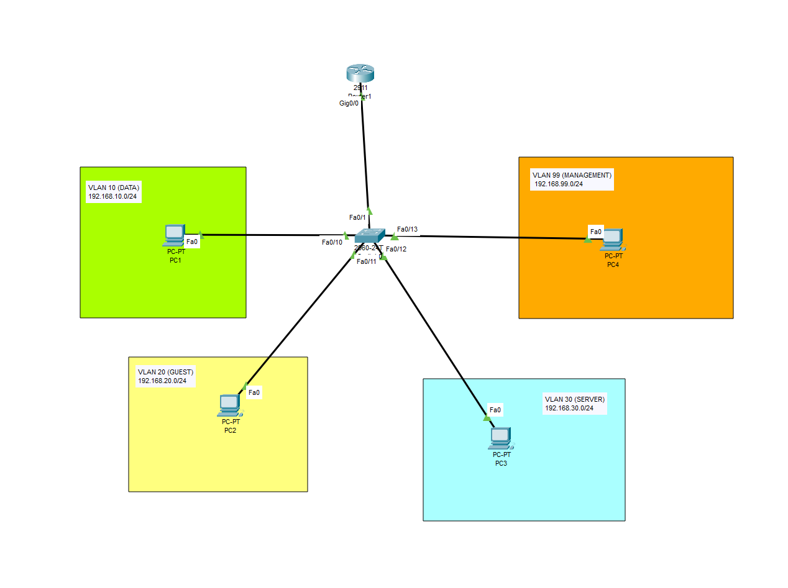

# enterprise-roas-dhcp-hardening
Cisco Packet Tracer simulation of a secure enterprise network with ROAS, DHCP, and SSHv2 hardening.

# Secure Multi-VLAN Enterprise Network Simulation

## Project Overview
This project simulates an enterprise network topology featuring segmented broadcast domains, automated IP addressing, inter-VLAN routing, and network-device hardening. The environment was designed and validated in Cisco Packet Tracer to demonstrate practical networking and security concepts.

## Network Architecture & Design
The topology utilizes a Router-on-a-Stick (ROAS) model to route traffic across four distinct functional subnets through a single physical interface line (`Fa0/1` to `Gi0/0`).

### Network Addressing & Segmentation Map

| VLAN ID | Subnet Name   | CIDR Block        | Default Gateway | Allocation Type |
| :---    | :---          | :---              | :---            | :---            |
| **10**  | Staff_Data    | 192.168.10.0/24   | 192.168.10.1    | DHCP Allocated  |
| **20**  | Guest_WiFi    | 192.168.20.0/24   | 192.168.20.1    | DHCP Allocated  |
| **30**  | Corp_Server   | 192.168.30.0/24   | 192.168.30.1    | DHCP Allocated  |
| **99**  | Management    | 192.168.99.0/24   | 192.168.99.1    | Statically Bound|

---

## Core Engineering Features

### 1. Inter-VLAN Routing (ROAS)
* Configured IEEE 802.1Q encapsulation and logical subinterfaces on a Cisco ISR Router to facilitate secure inter-VLAN routing.
* Configured an unused native VLAN to reduce the risk of VLAN hopping and isolate untagged traffic from production VLANs.

### 2. Automated Network Services (DHCP)
* Deployed Cisco IOS DHCP pools (STAFF_POOL, GUEST_POOL, SERVER_POOL) to automate client IP allocation across the designated network segments.
* Implemented explicit ip dhcp excluded-address blocks (.1 through .10) to reserve addresses for network gateways, infrastructure devices, and statically addressed hosts.

### 3. Layer 3 Security Access Controls (ACLs)
* Engineered and applied an extended Access Control List (`BLOCK_GUEST_TO_SERVER`) on the inbound direction of the Guest subinterface (`Gi0/0.20`).
* Enforced strict network segmentation by intercepting and dropping unauthorized inbound traffic originating from the Guest WiFi segment attempting to communicate with the Corporate Server segment (`192.168.30.0/24`).

### 4. Device Hardening & Management Plane Security
* Disabled Telnet and configured SSHv2 for encrypted remote device management using a 1024-bit RSA key modulus across the VTY lines (line vty 0 15).
* Restricted remote management entry across the network by embedding Switch Virtual Interfaces (SVIs) exclusively on a dedicated, statically bound Management VLAN (VLAN 99).
* Configured local authentication with privilege level 15 administrative credentials and protected access methods via an encrypted `enable secret`.

---

## Verification & Testing Records
* **DHCP Verification:** End hosts successfully pulled dynamic leases beginning precisely at `.11` (e.g., Staff PC received `192.168.10.11`), confirming the structural exclusion policies worked perfectly.
* **Security Validation:** Ping tests from VLAN 10 to VLAN 30 succeeded, while ICMP requests from VLAN 20 to VLAN 30 were blocked by the ACL applied to Gi0/0.20
* **SSH Hardening Validation:** Remotely connected to the Switch CLI over port 22 from the dedicated management workstation (PC4) using localized cryptographic credentials via `ssh -l admin 192.168.99.2`.
